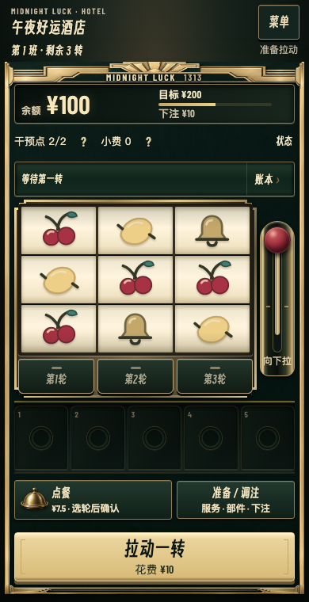

# Midnight Lucky Hotel

**Build the reels. Make your own luck.**

**English** · [简体中文](README.zh-CN.md)

A mobile-first slot-machine roguelite prototype, playable in English or Chinese
in your browser. Change actual reels, combine parts, and decide when to reroll,
pray or kick the machine. React UI, deterministic TypeScript engine. Still a
playtest: fun, clarity and balance need real player feedback.

**[Play in English](https://amatate.github.io/midnight-lucky-hotel/?lang=en)** ·
[中文试玩](https://amatate.github.io/midnight-lucky-hotel/?lang=zh) ·
[Send feedback](https://github.com/amatate/midnight-lucky-hotel/issues)

> All coins and bets are fictional. No deposits, real-money wagering or redemption.
> No account required. Saves are local, not cloud-synced. Source is public, but a
> source-code license has not yet been selected; see below.



## Why play?

- **Rebuild probability:** add, replace or remove actual symbols, not an invisible luck stat.
- **Build an income engine:** Cherry Jam, spreading Lemons, mixed Fruit Salad, copied Seven wins or machine damage. Some combinations work against each other.
- **Intervene carefully:** rerolls are random; kicks preview an exact move. Focus, tips, meals and damage create trade-offs.
- **Follow the winnings:** animated reels, itemized payouts, coin feedback, effect windows and a persistent ledger.
- **Keep improving:** complete a three-shift opening, then build across hotel rounds or keep playing in overtime.

Designed for portrait touch play, also playable on desktop. This is a Web/PWA
game, not a native mobile app. Use Add to Home Screen where your browser supports it.

## Latest playtest · October 5, 2026

- **Routes that start working earlier:** service selection grants a starter part and matching reel changes where applicable. The first Strengthen offer connects to it; later cards explain fit, missing prerequisites and conflicts. Read live charges and next triggers from the existing preparation panel.
- Chapel starts with four permanent Sevens per reel plus a Candle, 2 omens and 2 tips; Security starts with an Absorber and one crack per reel. Kitchen starts with a Vat; Repair starts with a Cherry Press and denser Cherries.
- Trial balance: L2 Vat release **24→18×** bet; L2 Absorber **3→4×** per physical crack (still capped at two). L1 part payouts and the base paytable are unchanged in this balance pass. [Methods, results and limitations](docs/implementation/2026-10-05-route-balance.md).
- Old archives are preserved. Explicit migration creates a new branch; starter kits apply only to new runs, never retroactively to a saved machine.
- 16 original synthesized sound effects and **After Hours**, a 48-second looping lounge track. Separate music/effects volumes, mute and sound previews in settings. [Audio notes](docs/audio.md).
- English/Chinese menus, guide, part and service descriptions, results and readable logs.
- Switch at the front desk or in the game menu without restarting your run.
- Share `?lang=en` or `?lang=zh`. Append `&seed=8` to share a seed.
- Garden, View and Penthouse: **3 rounds × 3 paid spins each**, with free upgrades after rounds 1 and 2. Trial cumulative goals: **¥1,000 / ¥2,400 / ¥6,000**.
- Each rest-stop upgrade is once per room per run, not repeated on retries.
- The final three rooms remain single-round special challenges. Mobile cabinet proportions and information density have also been revised.

Targets are playtest values, not finished balance. Legacy room attempts keep their
captured rules; re-entering uses the new format.

To try the starter kits, **begin a new run**. Export an older run before updating;
use the explicit migration option for supported saves. Do not clear browser data.

## Your first night

1. Start with ¥100 and choose one of three offered services, drawn from Repair Shop, Kitchen, Chapel and Security. Your starting part makes the route tangible immediately.
2. Spin, then keep the result or use one intervention. Rerolling is optional.
3. Ordinary shifts have three paid spins plus awarded free spins. Upgrade between early shifts; start with one coherent income engine.
4. Reach a ¥150 balance within three shifts. Older saves keep their five-shift / ¥200 opening. Open **Effects & costs** when unsure, **Ledger** for payouts, and **Full log** for actions.

Five paylines: three rows and two diagonals. Winnings are gross payouts, not
profit: subtract bets, meals and sacrifices. RTP above 100% guarantees neither
survival nor success within a spin limit.

## Run locally

Requires **Node.js 24.13.1+** and **npm 11.8.0+**.

```bash
git clone https://github.com/amatate/midnight-lucky-hotel.git
cd midnight-lucky-hotel
npm ci
npm run dev
```

Open [localhost:5173](http://localhost:5173/?lang=en), or the URL printed in the
terminal. On the same Wi-Fi, a phone can use the printed Network address if the
firewall allows it. Do not expose the development server to the public internet.

## Saves and reproducibility

- Saves, favorites and seeds belong to the **current browser and site origin**. Localhost, LAN and GitHub Pages do not share saves.
- Export before moving devices/sites or clearing data, then import at the destination. Restoring branches a run and keeps the original.
- Language is a separate preference: explicit URL, then saved choice, then browser language. Both languages use identical rules and RNG.
- Player-authored archive names and raw debug data are not translated. Readable logs are localized without rewriting events.
- Replays require the **same rules version, starting state and actions**, not just the seed.
- Supported old checkpoints can branch into current rules without recalculating old results.
- Updates are offered at the front desk, never forced during play. Export first and return other game tabs to the front desk too.

## Development

```bash
npm test -- --maxWorkers=2
npm run build
npm run preview
npx vitest run tests/app/language.test.tsx
node scripts/audit-journey.ts 24 0
```

| Directory | Responsibility |
| --- | --- |
| `src/core` | Deterministic commands, events, reels and settlement |
| `src/content` | Parts, services, upgrades, rooms and rules-side copy |
| `src/app` | React UI, interactions, help and archives |
| `src/i18n` | Display-only Chinese/English localization |
| `src/presentation` | Animation timing, audio and feedback |
| `src/persistence` | Local saves, validation and migrations |
| `src/sim` | Simplified simulations and statistics |
| `tests` / `e2e` | Rule, component and browser regressions |

See [localization maintenance](docs/localization.md) and
[three-room pacing notes](docs/implementation/2026-10-03-journey-pacing.md). The journey audit uses real opening choices and a fixed strategy, not optimal play or a player win-rate estimate. Automated checks verify
rules and regressions, not fun or perfect balance.

### GitHub Pages

Pushes to `main` trigger the [Pages workflow](https://github.com/amatate/midnight-lucky-hotel/actions/workflows/pages.yml):
tests, production build, then deployment. Settings → Pages must use GitHub Actions.

```bash
DEPLOY_BASE_PATH=/midnight-lucky-hotel/ npm run build
DEPLOY_BASE_PATH=/midnight-lucky-hotel/ npm run preview
```

Append `/midnight-lucky-hotel/?lang=en` to the printed preview address. Assets,
fonts and PWA scope use the same base path. Other older hosting is not updated.

## Feedback welcome

Play for about 10 minutes and tell us:

- Where did you first become unsure what to do?
- Which part or combination felt exciting, useless or too strong?
- When did you want to stop, and why?

Include browser/phone, game and rules versions, seed, steps, expected and actual
results. Inspect logs before attaching them; GitHub issues are public. The game
opens an editable issue draft with versions and seed only. It neither submits
automatically nor uploads your save.

Development uses AI assistance and generated visual assets. Design judgment and
real playtesting still matter. No analytics or accounts are needed to play.

## License and fonts

A source-code license has **not yet been selected**. Public access does not grant
an open-source license. A root `LICENSE` will be added when one is chosen.

Bundled fonts retain their licenses in [public/fonts/licenses](public/fonts/licenses).
