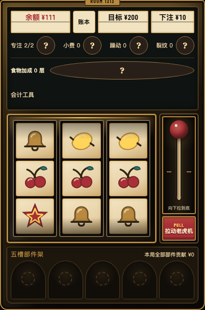

# 午夜好运酒店 · Midnight Lucky Hotel

**不是只等老虎机中奖，而是把它改造成自己的赚钱机器。**

A mobile-first, Chinese-language slot-machine roguelite prototype. Build the reels, combine parts, and decide when to intervene. Made with React and a deterministic TypeScript game engine.

这是一个优先追求「自己玩起来好玩」的小项目：通过改造转轮、搭配部件和有限干预，把随机结果变成可以经营的构筑。项目仍在迭代，欢迎真实试玩反馈。

**[打开网页试玩](https://midnight-lucky-hotel.green-emu-3354.chatgpt.site)** · [反馈问题](https://github.com/amatate/midnight-lucky-hotel/issues)

> 游戏中的金额和下注全部是虚拟资源，没有充值、真实货币投注或兑换功能。手机和电脑均可打开试玩；也可按下方说明本地运行。源码公开，但项目源码许可证尚未确定，见文末说明。



## 有什么好玩？

- **改造概率**：永久替换、增加或移除转轮上的符号，而不只是叠加一个看不见的幸运值。
- **搭配收入引擎**：樱桃果酱、柠檬感染、水果沙拉、小教堂祝福、故障回收等分支，可以组合，也可能互相拆台。
- **有限干预**：拉杆以外，还能重转、祈祷、踹击；不同服务提供锁轮、食物或维修等帮助。每次操作都有明确的消耗和代价。
- **把中奖看明白**：转轮动画、逐项跳动的奖金、金币反馈、可回看的账本，以及解释效果与代价的浮窗。
- **看见改造发生**：升级票据展示转轮前后变化，标记新增与移除；永久改造、班内代价分开说明。部件初次触发会留下可关闭的说明，只显示已入账的直接奖励。
- **继续挑战**：初期五班之后，可以保留构筑加班，或用固定下注挑战更高目标的酒店客房；房间结算可用金币整备。

游戏为竖屏和触屏设计，也可在桌面浏览器游玩；不是原生手机 App。

## 快速运行

需要 **Node.js 24.13.1 或更新版本**、**npm 11.8.0 或更新版本**。

```bash
git clone https://github.com/amatate/midnight-lucky-hotel.git
cd midnight-lucky-hotel
npm ci
npm run dev
```

打开 [http://localhost:5173/](http://localhost:5173/)。如果端口被占用，以终端打印的地址为准。

在同一局域网内，手机也可以打开终端显示的 Network 地址；需要电脑防火墙允许连接。开发服务会监听局域网，请不要将它直接暴露到公网。

### 第一局怎么上手

1. 从前台开始新游戏，选择一项服务。开局有 ¥100 虚拟余额。
2. 拉动转轮，决定直接收下，还是使用一次干预；并不是每转都需要重转。
3. 每班完成三次付费转及附带免费转后选升级。先围绕一种收入方式构筑，不必把同属水果的部件全拿走。
4. 点「效果与代价」看规则；结算看账本，想复盘则看完整日志。完整玩法和术语也在游戏介绍中。

盘面有五条支付线（三条横线、两条斜线）。中奖金额不等于净赚金额：下注、餐费和献祭等支出需要另外扣除。

## 存档与复现

- 存档、收藏和种子记录保存在**当前浏览器、当前站点地址**，不是云同步。`localhost`、`127.0.0.1` 和手机访问的局域网地址各有独立存档。
- 游戏内可导出、导入档案。清理浏览器数据或升级版本前，建议先导出备份。
- 完整日志包含操作、拒绝原因、结果和状态变化。**同规则版本、同起点、同操作**才可复现；种子相同并不代表不同玩法得到同一结果。
- 旧规则档案会保留；支持迁移的结算检查点可手动创建新版续玩分支，不覆盖原档，不重新判定旧成绩。
- 从本地版切换到网页试玩时，先导出本局，再在新站点导入；不会自动迁走或覆盖原存档。
- 新版本需要在前台主动点击更新，不在游玩中强制刷新。更新前建议导出备份；多标签游玩时请先让其他标签也回到前台。

## 开发与验证

```bash
npm test                # 规则、存档和组件测试
npm run build           # 类型检查与生产构建
npm run preview         # 本地查看生产构建
```

需要浏览器回归时，先安装 Playwright Chromium，再运行目标用例：

```bash
npx playwright install chromium
npm run build
npx playwright test --config playwright.archives.config.ts e2e/route-balance.spec.ts
```

该配置使用独立的浏览器上下文和端口 5174，不读取玩家的 Chrome 个人资料或存档。

### 代码结构

| 目录 | 职责 |
| --- | --- |
| `src/core` | 确定性规则、命令、事件、转轮与结算 |
| `src/content` | 部件、服务、升级池、房间与玩家文案 |
| `src/app` | React 游戏界面、交互、帮助与档案查看 |
| `src/presentation` | 音频与表现层 |
| `src/persistence` | 本地存档、档案校验与迁移 |
| `src/sim` | 简化模拟、统计与报告 |
| `tests` / `e2e` | 自动化规则与浏览器回归 |

最近的数值分析见 [路线收益审查](docs/validation/2026-09-07-route-balance.md) 和 [体验数值模型](docs/validation/2026-09-06-experience-model.md)。自动化检查验证规则和回归，不证明游戏已经好玩或各路线完全平衡。

## 当前边界与反馈

这是一个持续迭代的原型：路线平衡、后期内容和新手说明仍需要试玩反馈。会计工具的模拟是简化基线，不是当前局面的实时胜率；RTP 超过 100% 也不保证不破产或达成限转目标。

欢迎在 [GitHub Issues](https://github.com/amatate/midnight-lucky-hotel/issues) 反馈，尤其是：

- 哪个操作或结算看不懂？
- 哪个部件拿了之后反而觉得亏，或强到不再需要选择？
- 哪个房间让你想继续挑战，哪个让你觉得只是重复？

复现问题时，附上浏览器、规则版本、种子、操作步骤，以及实际结果和预期结果。导出档案可以帮助定位，但上传前请自行检查内容；不要附带无关个人信息。

游戏中的「反馈问题」只预填版本与种子，打开可编辑的 GitHub Issue 草稿，不会自动提交或上传日志。需要附件时由玩家检查后手动添加。

本项目在开发中使用 AI 辅助；设计判断和实际游玩体验仍需要人的检验。

## 许可证与字体

目前尚未为项目源码选择许可证，请勿将公开仓库理解为已授予开源使用许可。确定许可证后会在仓库根目录补充 `LICENSE`。

随仓库提供的字体遵循各自的许可，原文保留在 [public/fonts/licenses](public/fonts/licenses)。
